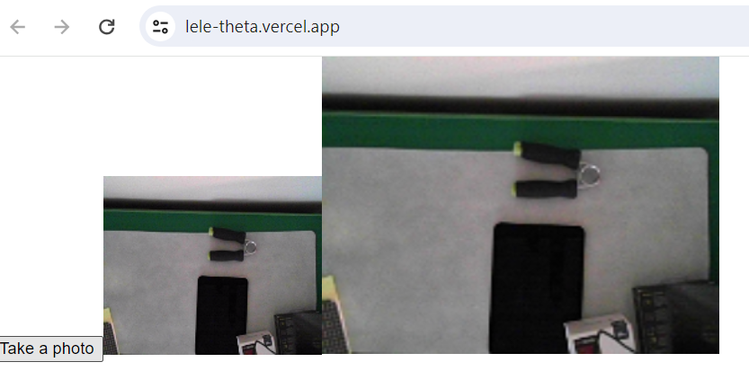

# 乐相机


源码 [Create React App](https://github.com/facebookincubator/create-react-app). Then an Express server was added in the `server` directory. The server is proxied via the `proxy` key in `package.json`.

## 米国的，在Vercel部署成功

[站点]（https://lele-theta.vercel.app/）

## Using this project

1. Clone the project, change into the directory and install the dependencies.

   ```bash
   git clone https://github.com/philnash/react-express-starter.git
   cd react-express-starter
   npm install
   ```

2. Create a `.env` file for environment variables in your server.

   ```bash
   touch .env
   ```

3. Start the server

   You can start the server on its own with the command:

   ```bash
   npm run server
   ```

   Run the React application on its own with the command:

   ```bash
   npm start
   ```

   Run both applications together with the command:

   ```bash
   npm run dev
   ```

   The React application will run on port 3000 and the server port 3001.


```
如果视频不顺畅，就用Twilio服务
The [twilio branch](https://github.com/philnash/react-express-starter/tree/twilio) is a similar setup but also provides endpoints with basic [Access Tokens](https://www.twilio.com/docs/iam/access-tokens) for [Twilio Programmable Chat](https://www.twilio.com/docs/chat) and [Twilio Programmable Video](https://www.twilio.com/docs/video). You can use the project as a base for building React chat or video applications.
```